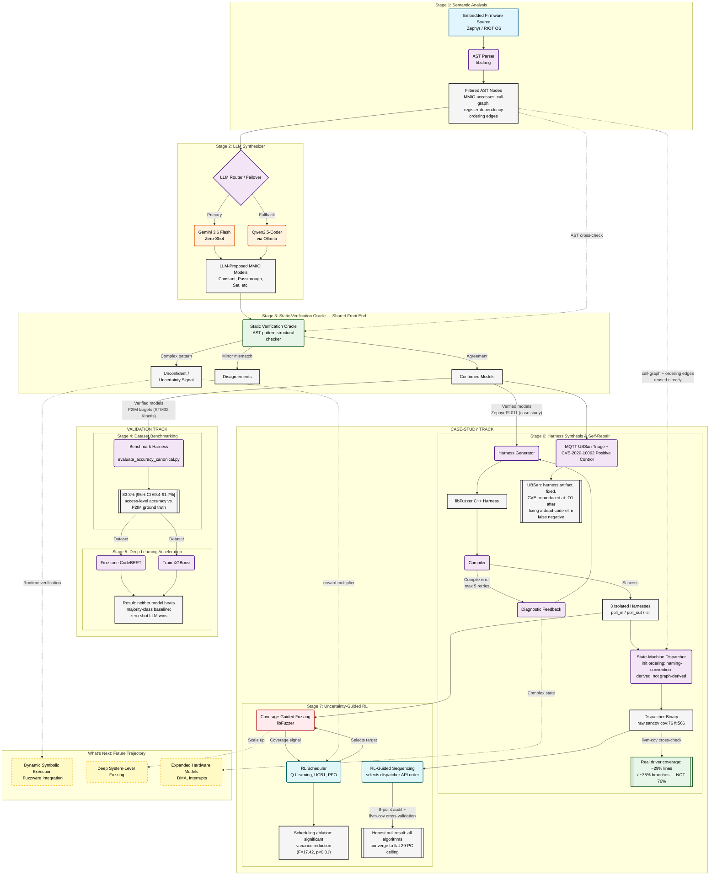

# AeroHarness: Agentic, Oracle-Verified Synthesis of Fuzz Drivers for Memory-Safety Bug Hunting in Embedded Firmware

This document presents the complete system architecture for **AeroHarness**, mapping the data flow, decision boundaries, and verification loops across all seven pipeline stages. This architecture is designed to be included in an international research paper or industry whitepaper.

> For a concise, presentation-ready visual (one figure, grid-aligned, with a legend and caption), see [`architecture.svg`](./architecture.svg), referenced from the README's Architecture section. The diagram below is the detailed technical flow, including the Stage 6/7 case-study internals and the independent cross-validation steps.
>
> **Independent re-audit (Oct 1 2026):** Stage 6's isolated-harness coverage numbers, the MQTT UBSan classification, the CVE-2020-10062 positive control, and the Stage 6/7 coverage measurement methodology were each independently re-verified against the repo. This surfaced and fixed stale coverage numbers, a build-flag-dependent false negative in the CVE control, and added missing `llvm-cov` source-level cross-validation. It also confirmed the Stage 7 RL-sequencing case study's honest null result stands. See `RESULTS.md` for full detail. This document has been updated to reflect those findings.
>
> **Diagram corrected (Oct 3 2026):** the diagram below previously fused Stage 3 and Stage 4 into a single subgraph (titled "Stage 3: Shared Front End — Stage 4: Validation Track"), with Stage 4's own content reduced to a single dotted edge label rather than a real process box — so a reader following the rendered diagram (not the prose) would only ever see 6 stage boxes, not the 7 this document claims, and the auto-laid-out edges crossed through unrelated subgraphs (confirmed by rendering it with `mermaid-cli` and inspecting the actual output, not just the source). Rebuilt with Stage 3 and Stage 4 as separate subgraphs, the Validation and Case-Study tracks as proper nested containers (so the layout engine keeps each track's stages grouped), and every cross-cutting reuse edge (call-graph/ordering-edge reuse into Stage 6, the uncertainty signal into Stage 7, and the future-work links) drawn dashed and distinct from the primary data-flow edges, matching `architecture.svg`'s existing legend convention. Re-rendered and visually verified before and after.

## System Architecture Diagram

---

## Component Breakdown: How Each Step Works

### Stage 1: Semantic Analysis (AST Extraction)
* **Mechanism**: Bypasses unstable regex parsing by employing a true C/C++ compiler frontend (`libclang`). It recursively traverses the Abstract Syntax Tree (AST) of RTOS firmware (e.g., Zephyr, RIOT OS).
* **Output**: Extracts function signatures, deterministic call-graph boundaries, and locates hardware interaction nodes—specifically identifying where code interacts with volatile memory-mapped I/O (MMIO) register structs.

### Stage 2: Agentic MMIO Classification
* **Mechanism**: LLM agents are supplied with the extracted AST context and a formal taxonomy adopted from Fuzzware (Constant, Passthrough, Bitextract, Set, Identity). The agent reads the source code context to deduce how a hardware register *behaves* when read/written.
* **Engineering Standard**: Implements a high-availability fallback router. If the primary cloud endpoint (Gemini) encounters a quota or `503` error, the system automatically offloads generation to a local LLM backend (Ollama, running Qwen2.5-Coder).

### Stage 3: Static Verification Oracle
* **Mechanism**: Operates as a completely independent, deterministic checker. It uses hand-written, deterministic pattern-matching rules on the AST to independently classify the register behavior.
* **Role**: It cross-checks the LLM's proposal. If they match, the model is **Confirmed**. If the static rules cannot resolve the behavior, it outputs an **Unconfident** signal. This prevents hallucinated models from poisoning the fuzzing campaign and explicitly quantifies uncertainty.

### Stage 4: Dataset Benchmarking
* **Mechanism**: The end-to-end extraction and classification pipeline is benchmarked against the gold-standard P2IM unit-test suite.
* **Result**: Achieved an empirically verified 83.3% accuracy ceiling using Gemini, proving that LLM-based static reasoning is a highly viable alternative to expensive dynamic symbolic execution.

### Stage 5: Deep Learning Acceleration (Ablation) — Validation Track
* **Mechanism**: Attempted to distill the expensive LLM logic into faster, smaller models (CodeBERT and XGBoost) using the Stage 4 benchmark as training data.
* **Result**: Neither trained model (CodeBERT 54.0%±24.4%, XGBoost 45.7%±25.3%) significantly outperforms a naive majority-class baseline (40.4%±33.9%; all pairwise p>0.10), against zero-shot LLM inference at 83.3%. The dataset's severe small-N register-level sample size is the cause (see `RESULTS.md` for the exact figures and significance tests — no single precise N is reported in the repo's own evaluation scripts, so none is claimed here). This solidified the finding that *Zero-Shot LLM inference* is currently irreplaceable for this task — a formally tested negative result for the trained classifiers, not an implementation failure.

### Stage 6: Autonomous Self-Repair Loop + Case-Study Enhancements — Case-Study Track
* **Mechanism**: The Confirmed models are injected into C++ `libFuzzer` harnesses for 3 PL011 functions (`pl011_poll_in`, `pl011_poll_out`, `pl011_isr`), spanning read, write, and interrupt paths. The system attempts to compile them natively. If compilation fails (e.g., due to missing headers or type mismatches), the `stderr` compiler diagnostic is fed *back* into the LLM context.
* **Engineering Standard**: Employs a "Bounded Retry" approach (max 5 retries, informed by the *QuartetFuzz* paper) to prevent infinite loops, successfully synthesizing fully operational ELF binaries. Surfaced two real static-mocking limitations along the way: busy-wait timeouts and write-1-to-clear register clobbering.
* **Enhancement 1 — State-Machine Dispatcher**: A unified harness bridges the 3 isolated functions using call-graph-inferred initialization sequences (the ordering itself is inferred from naming conventions, not literally read off the Stage 1 call graph — the call graph had no ordering constraints to use). Stage 1 now also infers register-co-access ordering edges (`_compute_ordering_edges`, Oct 3 2026, Work Plan item 11) and these do recover some real, data-grounded dependencies elsewhere in the driver — but confirmed NOT this specific one: `pl011_init` only read-modify-writes the registers this dispatcher's three functions touch, never plain-writes them, so no register access is actually shared between `pl011_init` and `pl011_poll_in`/`pl011_poll_out`/`pl011_isr` in the extracted data. This dispatcher's ordering therefore remains naming-convention-derived, honestly, not yet graph-derived. It reaches more raw sancov edges (`cov:76 ft:566`) than any isolated harness, but **independent `llvm-cov` source-level cross-validation (Oct 1 2026) shows the real figure is ~29% of the driver's lines and ~35% of its branches** — the raw PC count alone overstates this and must not be read as a driver-coverage percentage.
* **Enhancement 2 — MQTT UBSan Triage**: An initial UBSan violation on Zephyr's MQTT `properties_decode` function was triaged and definitively classified as a harness artifact (a mock macro promotion bug), not a real vulnerability. Independently reproduced Oct 1 2026: the pre-fix macro reproduces the exact UBSan error; the patched version is clean.
* **Enhancement 3 — CVE-2020-10062 Positive Control**: Validated pipeline capability against a known ground-truth vulnerability (an MQTT off-by-one, CWE-193). Proved isolated harnesses are blind to this API-contract violation, while a broad-scope, call-graph-aware harness detects the memory corruption within hundreds to low thousands of executions. Independently re-verified and fixed Oct 1 2026: rebuilding from source at the project's own documented `-O1` flag was silently failing to reproduce it — LLVM's dead-code-elimination was removing the vulnerable `malloc`/`memcpy`/`free` sequence because its result was never read. Fixed with a single `volatile` touch forcing the access to be observable; now reproducible at `-O1` as documented.

### Stage 7: RL-Guided Fuzzer Scheduling + Sequencing Case Study — Case-Study Track
* **Scheduling mechanism**: Multi-target fuzzing traditionally spends equal CPU time on all entry points. AeroHarness deploys Reinforcement Learning (Q-learning, UCB1, PPO) to prioritize which harnesses to fuzz.
* **Key Innovation**: The RL agent's reward is multiplied by the *Uncertainty Signal* generated in Stage 3. This directs the fuzzer to spend more time exploring code paths where the Oracle was unconfident, resulting in a statistically significant variance-reduction benefit (F=17.42, p<0.01) over random search — characterized, via the Coupon Collector's Problem, as a robustness/variance effect rather than a mean-performance one. Confirmed across 10 seeds for all 3 algorithms.
* **RL-Guided Sequencing (methodology case study)**: The same RL framework was extended to select API call sequences for the Stage 6 state-machine dispatcher, decoupling sequence length from libFuzzer's mutational payload entirely. Initial results appeared to show Q-learning beating Random (54 vs 41 PCs) — but an exhaustive 8-point measurement audit unmasked every apparent RL victory as a reward-hacking vulnerability or measurement artifact (unsigned underflows, debug `printf` self-rewards, harness-router branch inflation). After a rigorous structural fix (`__attribute__((no_sanitize("coverage")))` + `-fno-inline`) scoped coverage strictly to the target driver, independent `llvm-cov` source-profiling confirmed the true, artifact-free result: **all three algorithms (Random, UCB1, Q-learning) converge to identically flat driver-level coverage (29 PCs)**, reflecting the benchmark's shallow state space rather than a general claim about RL. This honest null result — and the methodology for detecting reward-hacking in RL-guided fuzzing — is itself a core contribution of this work, not a setback to omit.

---

## What's Next: Industry & Research Trajectory

To elevate AeroHarness from a unit-test-scale research prototype to an industry-grade, system-level vulnerability discovery framework, the following tracks define the immediate future work:

### 1. Dynamic Symbolic Execution (DSE) Handoff
* **The Gap**: Stage 3's static oracle is a lightweight approximation. It correctly identifies its own limitations (flagged as "Unconfident") but currently cannot dynamically resolve them.
* **The Solution**: Directly integrate the pipeline with Fuzzware's DSE engine. When the static Oracle flags a register as "Unconfident", the system will automatically spin up a dynamic QEMU emulator to trace the exact semantic behavior at runtime, achieving 100% ground-truth accuracy on complex states.

### 2. Deep System-Level Fuzzing Integration
* **The Gap**: Stages 6 and 7 proved viability on standalone HAL driver functions (e.g., `pl011_poll_in`). Real-world firmware bugs often require reaching deep state machines across the entire RTOS network stack or file system.
* **The Solution**: Expand the AST semantic extraction (Stage 1) to build whole-program dependency graphs, enabling the LLM to synthesize harnesses that initialize entire RTOS subsystems rather than isolated unit tests.

### 3. Continuous-State RL for Fuzzer Scheduling
* **The Gap**: The Stage 7 evaluation demonstrated that complex algorithms like PPO collapse under a strict fuzzing budget (Coupon Collector limit) when target states are discrete and shallow.
* **The Solution**: Transition the RL observation space from shallow target-selection to real-time, continuous metrics (e.g., branch-coverage velocity, memory-allocation density). This will allow advanced policies like PPO to learn deep, programmatic insights over a multi-day fuzzing campaign, breaking past the discrete mathematical limitations identified in this study.

### 4. Advanced Hardware Semantics (DMA & Interrupts)
* **The Gap**: The current taxonomy accurately models synchronous MMIO access. However, Direct Memory Access (DMA) and complex asynchronous hardware interrupts are not strictly modeled.
* **The Solution**: Extend the LLM prompting architecture and AST extraction to capture asynchronous data structures and DMA ring-buffers, allowing the fuzzer to accurately mock hardware race conditions and concurrency bugs.
