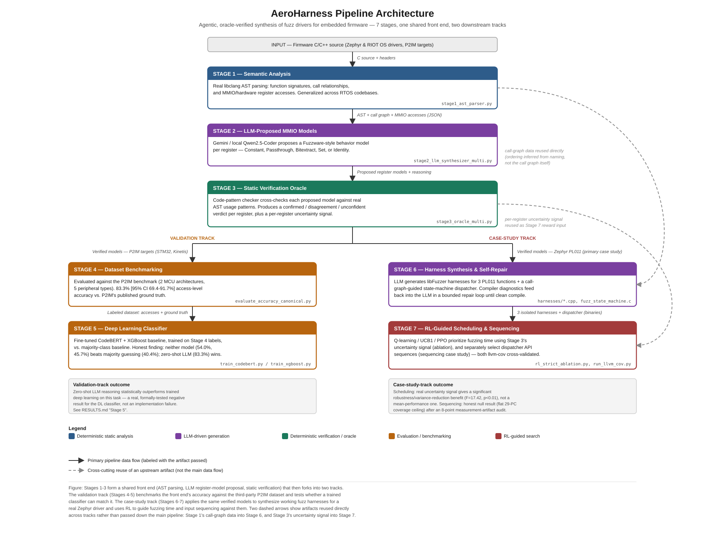

# AeroHarness

**AeroHarness: Agentic, Oracle-Verified Synthesis of Fuzz Drivers for Memory-Safety Bug Hunting in Embedded Firmware**

## Overview

AeroHarness is a research prototype exploring how LLM agents, combined with deterministic verification oracles, can automate fuzz-harness engineering for embedded C/C++ firmware. Coverage-guided fuzzing (AFL++, libFuzzer) is the standard for memory-safety bug discovery, but applying it to embedded firmware is bottlenecked by the manual effort needed to reverse-engineer hardware and build entrypoint harnesses.

The gap this project targets: existing work addresses one half of this problem each. Fuzzware (USENIX Security '22) automatically models hardware/MMIO register behavior via dynamic symbolic execution, but has no semantic understanding of code. A separate line of LLM-agent fuzz-harness-generation work uses source-level correctness checks, but has so far only been applied to ordinary software libraries, not to firmware requiring hardware mocking. AeroHarness combines both directions: an LLM agent proposes hardware register behavior using semantic code understanding, and that proposal is verified against real code-usage patterns before being trusted and used to synthesize working fuzz harnesses.

## Architecture



Stages 1–3 form a shared front end (AST parsing, LLM register-model proposal, static verification) that then forks into two tracks: a **Validation Track** (Stages 4–5), which benchmarks the front end's accuracy against the third-party P2IM dataset and tests whether a trained classifier can match it, and a **Case-Study Track** (Stages 6–7), which applies the same verified models to synthesize working fuzz harnesses for a real Zephyr driver and uses RL to guide fuzzing time and input sequencing against them. Two dashed arrows show artifacts reused directly across tracks rather than passed down the main pipeline: Stage 1's call-graph data into Stage 6, and Stage 3's uncertainty signal into Stage 7.

## Pipeline Stages (1-7)

* **Stage 1 — Semantic Analysis**: Real AST-based parsing (`stage1_ast_parser.py`, via libclang) extracts function signatures, call relationships, and MMIO/hardware register accesses from firmware source. Generalized across RTOS codebases (validated on Zephyr and RIOT OS). Also infers candidate prerequisite/ordering edges between functions from shared-register write-then-read dependencies (`_compute_ordering_edges`), closing part of a previously naming-convention-only gap — see `ARCHITECTURE.md`'s Enhancement 1 note for what this does and does not yet recover.
* **Stage 2 — LLM-Proposed MMIO Models**: For each hardware register access, an LLM (Gemini and/or local Qwen2.5-Coder via Ollama) proposes a Fuzzware-style behavior model — Constant, Passthrough, Bitextract, Set, or Identity — with grounded reasoning (`stage2_llm_synthesizer_multi.py`, `stage2_kinetis_gemini.py`). Includes automatic Gemini-to-Ollama failover for free-tier quota limits.
* **Stage 3 — Static Verification Oracle**: A code-pattern-based checker (`stage3_oracle_multi.py`) cross-checks each LLM-proposed model against real AST usage patterns. Explicitly a simplified static approximation of Fuzzware's dynamic symbolic execution, documented as such (faculty-approved scope decision).
* **Stage 4 — Dataset Benchmarking**: Evaluated against P2IM, the standard benchmark used by Fuzzware and related work, across two microcontroller architectures (STM32, NXP Kinetis) and 5 peripheral types. Achieved 83.3% [95% CI: 69.4%–91.7%] access-level accuracy on the STM32/RIOT USART benchmark against P2IM's published ground truth (script: `evaluate_accuracy_canonical.py`).
* **Stage 5 — Deep Learning Classifier**: Fine-tuned CodeBERT and an XGBoost baseline trained on the Stage 4 dataset, evaluated against a majority-class baseline with formal significance testing. Honest finding: neither trained model (CodeBERT 54.0%±24.4%, XGBoost 45.7%±25.3%) significantly outperforms naive majority-class guessing (40.4%±33.9%, all p>0.10), while zero-shot LLM inference (83.3%) meaningfully outperforms both.
* **Stage 6 — Harness Synthesis & Self-Repair Loop**: Real libFuzzer harnesses generated for 3 functions (`pl011_poll_in`, `pl011_poll_out`, `pl011_isr`) spanning read, write, and interrupt paths. Compilation failures are fed to the LLM as real diagnostics, repeated until success (bounded retry). Surfaced two real static-mocking limitations: busy-wait timeouts and write-1-to-clear register clobbering.
  * **Enhancement 1 (State-Machine Dispatcher)**: Built a unified harness bridging the 3 isolated functions using call-graph-inferred initialization sequences (Stage 1 data). Reaches more total coverage than any isolated harness, but only ~29% of the real driver's lines/~35% of its branches by independent `llvm-cov` measurement — the raw sancov PC count alone overstates this and should not be read as a coverage percentage (see `RESULTS.md` for the full isolated-vs-dispatcher comparison, independently re-verified and corrected Oct 1 2026).
  * **Enhancement 2 (MQTT UBSan)**: Triaged an initial UBSan violation on the Zephyr MQTT `properties_decode` function, definitively classifying and fixing it as a harness artifact (mock macro promotion bug), not a vulnerability. Independently reproduced (Oct 1 2026): the pre-fix macro reproduces the exact UBSan error, the patched version is clean.
  * **Enhancement 3 (Ground-Truth Methodology Validation)**: Validated pipeline capability against a known positive control (CVE-2020-10062: MQTT off-by-one). Proved that isolated harnesses are blind to this API contract violation, but a broad-scope, call-graph-aware harness modeling a naive application consumer detects the memory corruption within hundreds to low thousands of executions (<1 second). (Explicitly a positive-control validation, not a new discovery.) Independently re-verified and fixed (Oct 1 2026): the harness originally failed to reproduce this at the project's own documented `-O1` build flag — LLVM's optimizer was dead-code-eliminating the vulnerable code path — now fixed and reproducible (see `RESULTS.md`).
  * **Informed-vs-blind harness ablation (Oct 1 2026)**: Tested whether Stage 2/3's semantic MMIO modeling actually earns more coverage than an engineer with no hardware-semantic analysis would get from raw-fuzzing the whole register struct. Finding: it's **not a blanket coverage multiplier**. For shallow functions with few branches (`poll_in`, `isr`), a blind harness that raw-memcpy's fuzzer bytes onto the whole struct converges to the *identical* coverage ceiling as the informed harness, in well under 20,000 executions either way. The real, measurable benefit shows up specifically on `poll_out`, which has a single-bit hazard (`PL011_FR_TXFF`) that causes an immediate hang: the informed harness (which isolates that bit into a dedicated byte) reached the deeper pre-hang coverage state in 9/10 seeds, vs. only 3/10 for the blind harness, which has to find that same bit by chance inside a 76-byte raw blob. See `RESULTS.md` for the full methodology, multi-seed data, and `llvm-cov` cross-validation.
* **Stage 7 — Uncertainty-Guided RL Scheduling & State-Machine Sequencing**: 
  * **Ablation**: Q-learning, UCB1, and PPO agents trained to prioritize fuzzing time using Stage 3's uncertainty data as an added reward signal. Characterized, via the Coupon Collector's Problem (empirically validated), the scale at which scheduling helps vs. random search. An ablation confirmed the real uncertainty signal provides a statistically significant robustness/variance-reduction benefit (F=17.42, p<0.01), not a mean-performance one. 10-seed final results across all 3 algorithms confirmed.
  * **RL-Guided Sequencing (Methodology Case Study)**: Extended the RL framework to select API sequences for the Stage 6 state-machine dispatcher, completely decoupling sequence length from libFuzzer's mutational payload. Initial results appeared to show Q-learning outperforming Random (54 vs 41 PCs). However, an exhaustive 8-point measurement audit unmasked every apparent RL victory as a reward-hacking vulnerability or measurement artifact (e.g., unsigned underflows, debug `printf` self-rewards, and harness-router branch inflation). Applying a rigorous structural fix (`__attribute__((no_sanitize("coverage")))` + `-fno-inline`) strictly scoped coverage to the target driver. Independent `llvm-cov` source-profiling confirmed the true, artifact-free result: **all algorithms (Random, UCB1, Q-learning) converge to identically flat driver-level coverage (29 PCs).** This honest null result is a reflection of the benchmark's shallow state space (a single 10-step random sequence hits 90% of branches), not a general claim about RL. The real contribution is the rigorous methodology case study mapping the failure modes of raw coverage counters in RL-guided fuzzing (see `RESULTS.md`).

## Current Project Status

All 7 stages implemented and empirically evaluated with real execution evidence. See `RESULTS.md` for the canonical results ledger with links to raw logs. Key findings:

* Semantic parsing generalizes across RTOS codebases (Zephyr, RIOT).
* 83.3% MMIO-classification accuracy [95% CI: 69.4%–91.7%] against P2IM (STM32/RIOT).
* Zero-shot LLM reasoning outperforms trained deep learning, formally confirmed via significance testing.
* Real compiler-driven self-repair loop demonstrated on 3 functions.
* RL-guided scheduling characterized across 3 algorithms and 10 seeds: no mean-performance advantage at unit-test scale, but a significant robustness benefit.
* Informed-vs-blind harness ablation (Oct 1 2026): semantic MMIO modeling is not a blanket coverage multiplier — it makes no measurable difference on shallow functions, but meaningfully increases the odds of reaching deeper coverage before an unguided fuzzer stumbles into a single-bit hazard inside a much larger raw search space.
* Second-RTOS/target pipeline run (Oct 1 2026): ran Stages 1–6 end-to-end on RIOT OS's Kinetis K64F ADC driver (`kinetis_adc_calibrate`) — a different RTOS and peripheral type from the Zephyr/UART work above. Found and fixed 3 real pre-existing pipeline gaps (a Stage 1 AST-extraction bug, a sparse never-completed Stage 2 run, Stage 3 never having been run on this function at all) and a new, more severe static-mocking limitation class: a register bit the target function sets *and* spins on itself, unconditionally unfuzzable under single-shot struct mocking (unlike prior fuzzer-controlled-bit busy-waits, no input can avoid it). Fixed after 3 failed thread-based self-repair attempts with a periodic POSIX-timer/signal mechanism; `llvm-cov` confirms the real driver function reaches 100% line coverage once an input survives the function's busy-waits. See `RESULTS.md`.
* Ongoing verification: a prompt-methodology inconsistency was found between our Zephyr and Kinetis Stage 2 scripts and corrected; a Gemini spot-check on the corrected prompt (n=13, see `RESULTS.md`) tentatively supports consistent performance across architectures, though the sample's limited register diversity means this remains a preliminary finding.
* Independent re-audit (Oct 1 2026): Stage 6's isolated-harness coverage numbers, the MQTT UBSan classification, the CVE-2020-10062 positive control, and the Stage 6 coverage measurement method were each re-verified from scratch against the actual repo (not just the prose claims). Two real defects were found and fixed in the process — stale/incorrect isolated-harness coverage numbers, and a build-flag-dependent false negative in the CVE positive control — and `llvm-cov` cross-validation (previously missing for Stage 6) was added for all four Stage 6 harnesses. See `RESULTS.md` for full detail.
* Documentation audit (Oct 1 2026): formal difficulty stratification, corpus growth/time-to-new-path, cost accounting, failure taxonomy, hardware-mocking metrics, and two ablation studies already existed as real, complete work (`stage6_difficulty_metrics.md`, `corpus_growth_analysis.md`, `COST_ACCOUNTING.md`, `FAILURE_TAXONOMY.md`, `HARDWARE_MOCKING_METRICS.md`, `STAGE6_HARNESS_METRICS.md`, `ABLATION_A.md`, `ABLATION_B.md`/`ABLATION_B_V2.md`) but were never linked from this README, `RESULTS.md`, or `EVALUATION_PROTOCOL.md` — invisible to any audit that only follows those three files. Wired in and updated with today's Kinetis ADC evidence. Also corrected a factual error found in 3 of those files: an attribution to a non-existent "Gemini 3.6 Flash" model, corrected (at the time) to the then-configured `gemini-1.5-pro` by reading `src/synthesizer/agent.py`/`config/settings.py` directly. See `RESULTS.md`'s "Documentation Audit" section for full detail. **That correction is itself now dated** — `config/settings.py` has changed twice more since; `FAILURE_TAXONOMY.md` and `config/settings.py` are the live source of truth for which model is actually configured, not this note or the ablation docs it refers to.
* Vulnerability discovery at scale (Oct 3 2026): scaled the project's existing fuzzing campaigns by ~2-3 orders of magnitude (seconds-scale → hundreds of millions of executions per target, ~8 real sustained minutes each). Caught and fixed a genuine sandbox infrastructure failure along the way (backgrounded campaigns silently killed after ~5 minutes; see `FAILURE_TAXONOMY.md`). Honest result: zero vulnerability class beyond the already-documented hazards found at this scale. See `RESULTS.md`.
* Fuzzware head-to-head (Oct 3 2026): built Fuzzware's own native toolchain and a genuine bare-metal ARM target for the real `uart_pl011.c` driver (`item7_fuzzware/`, since Fuzzware's bundled examples have no PL011 content), and ran it head-to-head against AeroHarness's own host-compiled dispatcher harness on the same driver. Both tools fuzz cleanly, both plateau on coverage within minutes, zero crashes either way — Fuzzware's hardware-level MMIO fuzzing and AeroHarness's host byte-stream dispatcher converge on the same practical ceiling, at a ~45-50x throughput cost for Fuzzware's Unicorn-emulation approach. See `RESULTS.md`'s "Work Plan Item 7" section.
* Compiler-oracle-presence ablation (Work Plan item 8): does a compile-check+retry loop existing at all (vs. true one-shot generation) measurably change success rate? `qwen2.5-coder:7b` leg DONE and independently verified (Oct 4 2026): aggregate 4% vs. 14% (McNemar's exact p=0.0020), but all 10 loop-rescued trials concentrate on 2 of 5 targets — the other 3 (highest cyclomatic complexity) sit at a clean 0/20 floor under both conditions regardless of feedback. See `ABLATION_G.md` and `EVALUATION_PROTOCOL.md` Table 16. `qwen2.5-coder:14b` leg in progress.
* Static-analysis-lint feedback ablation, in progress (Oct 3 2026): closes the literal "static analysis lints" gap in Objective 2 — does feeding back `clang-tidy` warnings alongside the real compiler error help over compiler-only feedback? Two-independent-arm script written, smoke-tested, committed and pushed (`run_ablation_e_lint.py`, n=20/target/model planned); execution handed off, results not yet in. See `EVALUATION_PROTOCOL.md` Table 17.

## Datasets & Provenance

All datasets are real, publicly available, third-party sources.

* **Zephyr uart_pl011.c**: `drivers/serial/uart_pl011.c` from the official Zephyr RTOS repository, downloaded August 2026 (exact commit hash not preserved; pinning is noted as future work).
* **P2IM unit test benchmark**: `github.com/RiS3-Lab/p2im-unit_tests` (Feng et al., USENIX Security 2020), the standard benchmark also used by Fuzzware. Vendored directly into `/p2im-unit_tests/`. Test cases used: RIOT/USART/f103 (STM32F103), SPI/I2C/ADC/TIMER under Kinetis K64F. Ground-truth labels taken as-is from the original authors' CSVs.
* **RIOT OS driver sources**: from within the vendored P2IM repo's bundled RIOT environment.

## Repository Structure

* `/legacy_v1/` — Historical reference only; pre-audit implementation with fabricated/stubbed components, kept for transparency.
* **Root directory** — Core pipeline scripts for Stages 1–7 (flat layout; refactor into `src/`/`benchmarks/` planned but not executed, to preserve reproducibility of existing results).
* `/*.json` — Extracted ASTs and LLM MMIO proposal datasets.
* `/harnesses/`, `/targets/` — Generated fuzz harness sources, compiled binaries, deep-target decompositions.
* `/cb_*/` — CodeBERT checkpoints (Stage 5).
* `/p2im-unit_tests/`, `/zephyr-src/` — Vendored third-party datasets.
* `RESULTS.md` — Canonical results ledger.
* `EVALUATION_PROTOCOL.md` — Definitive list of paper tables/results.
* `REPRODUCE.md` — Independent reproduction guide.

## Reproducing Key Results

See `REPRODUCE.md` for full setup. Quick start:

```bash
python3 stage1_ast_parser.py <path_to_driver.c>
python3 evaluate_accuracy_canonical.py
python3 rl_strict_ablation.py       # Stage 7 scheduling ablation (F=17.42, p<0.01) — verified current (Oct 1 2026)
python3 run_llvm_cov.py             # Stage 7 sequencing case study: consolidated harness (fuzz_consolidated.c)
                                     # + independent llvm-cov cross-validation — reproduces the flat-29-PC null
                                     # result across all 6 conditions (verified Oct 1 2026)
```

## Related Work

* **Fuzzware** (Scharnowski et al., USENIX Security 2022) — our Stage 2/3 taxonomy is adopted from this paper. [usenix.org/conference/usenixsecurity22/presentation/scharnowski](https://www.usenix.org/conference/usenixsecurity22/presentation/scharnowski)
* **P2IM** (Feng et al., USENIX Security 2020) — the benchmark dataset used in Stage 4. [usenix.org/conference/usenixsecurity20/presentation/feng](https://www.usenix.org/conference/usenixsecurity20/presentation/feng)

**Correction (Oct 4 2026):** this section previously also cited "QuartetFuzz (Sheng et al., 2026)" as the basis for Stage 6's bounded-retry self-repair design. That citation could not be verified against any real, indexed publication (checked against USENIX, arXiv, and general web search) and has been removed, here and in `ARCHITECTURE.md`. The Stage 6 design itself is unaffected — a bounded retry count (max 5 attempts) is a standard safeguard against infinite loops in any LLM-agent retry mechanism and doesn't depend on that citation; it just shouldn't have been attributed to a specific paper that doesn't appear to exist. Caught while sourcing citations for a public write-up of this project, not during any formal citation audit — flagging that as a gap worth closing before paper submission: a dedicated pass checking every citation in this repo against a real, verifiable source.
